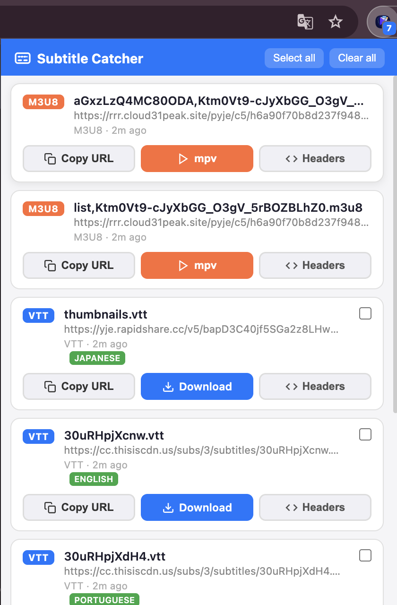

# Stream + Subtitle Catcher

<p align="center">
  
</p>

Chrome extension that captures **HLS/m3u8 and DASH/MPD streams** and **subtitle files** with their original request headers, then generates **mpv/IINA-ready commands** and **ffmpeg download commands** for external playback.

[](https://github.com/haliliceylan/subtitle-capture-ext)
[](LICENSE)

---

## Screenshot



*Detected streams and subtitles with one-click mpv command generation*

---

## Why This Extension?

When you try to open an m3u8 URL directly in IINA or mpv, it often fails because:
- Missing `Referer` / `Origin` headers expected by CDN
- Missing `Cookie` / `User-Agent` for authenticated streams
- Tokenized URLs that expire quickly
- Master playlist opens but segment/key requests are blocked

This extension solves that by:
1. Capturing the **exact headers** used by the browser
2. Detecting both **streams** (m3u8/HLS) and **subtitles** (VTT, SRT, ASS, etc.)
3. Building a **copy-ready mpv command** with proper header injection

---

## Features

- ✅ Detects **HLS/m3u8** and **DASH/MPD** streams automatically
- ✅ Captures subtitle files (VTT, SRT, ASS, SSA, TTML, DFXP, etc.)
- ✅ **Automatic language detection** for subtitles using Chrome's built-in CLD
- ✅ Stores request headers (Referer, Origin, Cookie, User-Agent, etc.)
- ✅ Generates **mpv command** with `--http-header-fields` and `--sub-file` options
- ✅ Generates **ffmpeg command** for downloading streams with subtitles
- ✅ **Direct download** button for MP4/WebM video files
- ✅ Select multiple subtitles to include in one command
- ✅ **"Select all" button** to quickly select/deselect all subtitles
- ✅ Badge counter shows detected items per tab
- ✅ Auto-cleanup on tab close/navigation
- ✅ **Theme support** (light/dark/auto) - click the moon/sun icon to cycle themes
- ✅ **Master playlist support** - parses HLS master playlists to show available variants with resolution, codec, and bitrate
- ✅ **Duration and size estimation** - calculates total duration and estimated file size for each variant

---

## Installation

### From Chrome Web Store (Coming Soon)

*Extension is pending Chrome Web Store review. Check back soon!*

### Manual Installation (Developer Mode)

1. Clone or download this repository:
   ```bash
   git clone https://github.com/haliliceylan/subtitle-capture-ext.git
   ```
2. Open Chrome → `chrome://extensions/`
3. Enable **Developer mode** (top right)
4. Click **Load unpacked** → select the `subtitle-capture-ext` folder
5. Extension icon appears in toolbar

---

## Usage

### 1. Capture Streams & Subtitles

1. Navigate to any video streaming site
2. Play the video (or let the page load the player)
3. Extension badge shows count of detected items
4. Click extension icon to open popup

### 2. Generate Playback/Download Commands

**For HLS/DASH streams (m3u8/mpd):**
- Click the **mpv** button (orange) to generate a playback command
- Click the **ffmpeg** button to generate a download command
- Command is copied to clipboard automatically
- Paste in terminal and run

**For direct video files (MP4/WebM):**
- Click the **Download** button to save the file directly

**With subtitles:**
- Check the checkbox on subtitle items you want to include
- Click **mpv** or **ffmpeg** button on the stream
- Generated command includes `--sub-file` (mpv) or additional `-i` inputs (ffmpeg) for each selected subtitle

### 3. Example Output

**mpv command (for playback):**
```bash
mpv --http-header-fields='Referer: https://example.com,Origin: https://example.com,User-Agent: Mozilla/5.0...,Cookie: session=abc123' --force-window=immediate --sub-file='https://cdn.example.com/subtitles/en.vtt' --sub-file='https://cdn.example.com/subtitles/es.srt' 'https://cdn.example.com/stream/master.m3u8'
```

**ffmpeg command (for downloading):**
```bash
ffmpeg -loglevel error -stats -headers 'Referer: https://example.com\r\nOrigin: https://example.com\r\n' -i 'https://cdn.example.com/stream/master.m3u8' -i 'https://cdn.example.com/subtitles/en.vtt' -i 'https://cdn.example.com/subtitles/es.srt' -c copy -c:s mov_text output.mp4
```

### 4. Use with IINA (macOS)

IINA uses mpv internally, so the same command works:

```bash
# Option 1: Direct command
iina --mpv-http-header-fields='...' --mpv-sub-file='...' 'https://...'

# Option 2: Use mpv command as-is (IINA will handle it)
mpv --http-header-fields='...' 'https://...'
```

Or use IINA's GUI:
1. Copy the m3u8 URL from extension
2. Open IINA → File → Open URL
3. Paste URL
4. Go to Preferences → Advanced → Extra mpv options
5. Add: `--http-header-fields='Referer: ...,Origin: ...'`

---

## Popup Actions

| Button | Action |
|--------|--------|
| **Select all** | Toggle select/deselect all subtitle checkboxes |
| **Copy URL** | Copy raw URL to clipboard |
| **mpv** (HLS/DASH stream) | Generate and copy mpv command with headers + selected subtitles |
| **ffmpeg** (HLS/DASH stream) | Generate and copy ffmpeg download command with headers + selected subtitles |
| **Download** (video file) | Direct download for MP4/WebM files |
| **Download** (subtitle) | Direct download link for subtitle files |
| **Headers** | Toggle header display panel |
| **Headers (right-click)** | Copy curl command with headers |
| **Clear all** | Remove all captured items for current tab |

### Subtitle Language Detection

The extension automatically detects the language of subtitle files by:
1. Fetching a portion of the subtitle content
2. Extracting plain text (removing timestamps, tags, formatting)
3. Using Chrome's built-in Compact Language Detector (CLD)

Detected languages are shown as a green badge on subtitle cards (e.g., "English", "Spanish", "Japanese").

---

## Technical Details

### Content Script for Header Handling

The extension injects a **content script** (`content-script.js`) to fetch m3u8 playlists directly from the page context. This approach:
- Uses the page's natural **Origin** and **Referer** headers
- Ensures **Cookie** and authentication headers are properly included
- Is essential for authenticated streams that validate headers on the server

### Captured Headers

The extension stores these headers (browser-managed headers are excluded):
- `Referer`
- `Origin`
- `User-Agent`
- `Cookie`
- `Authorization`
- Custom headers set by the site

**Excluded** (not needed for replay):
- `Range`, `Content-Length`, `Content-Type`
- `Accept-*`, `Cache-Control`, `Pragma`
- `Sec-Fetch-*`, `Upgrade-Insecure-Requests`

### Master Playlist Parsing

When an **HLS master playlist** is detected, the extension:
1. Parses the playlist to extract all available variants
2. Displays each variant with:
   - **Resolution** (e.g., 1080p, 720p, 480p)
   - **Codec** (e.g., H264, H265/HEVC)
   - **Bitrate** (e.g., 5 Mbps, 2 Mbps)
   - **Estimated file size** (calculated from bitrate × duration)
3. Allows users to select which variant to use in generated mpv/ffmpeg commands
4. Fetches the media playlist to calculate **total duration** (formatted as "2h 15m", "45m 30s", etc.)

### Detected Formats

**Streams:**
- **HLS**: m3u8, m3u (HLS playlists)
  - MIME: `application/vnd.apple.mpegurl`, `application/x-mpegurl`
- **DASH**: mpd (MPEG-DASH manifests)
  - MIME: `application/dash+xml`, `application/vnd.mpeg.dash.mpd`
- **Video files**: mp4, webm, mkv, mov (direct download)
  - MIME: `video/mp4`, `video/webm`, `video/x-matroska`, etc.

**Subtitles:**
- vtt, srt, ass, ssa, sub, ttml, dfxp, sbv, stl, lrc, smi
- MIME: `text/vtt`, `application/x-subrip`, `text/x-ass`, etc.

### Storage

Items are stored per-tab in `chrome.storage.local`:
- `streams_{tabId}` → detected streams
- `subs_{tabId}` → detected subtitles
- Auto-cleared on tab close or navigation

---

## Troubleshooting

### Stream still fails in mpv/IINA

1. **Token expired** → Refresh page, re-capture URL quickly
2. **Dynamic headers** → Some sites generate per-request signatures in JS (can't be replayed)
3. **DRM-protected** → Extension can't bypass DRM (Widevine, FairPlay)
4. **Geo-restriction** → Use VPN if stream is region-locked

### No items detected

1. **Play the video** → Some sites lazy-load manifests
2. **Check network tab** → Verify m3u8 requests are actually made
3. **Blocked sites** → Extension doesn't capture from `chrome://` or extension pages

### Headers not working

1. **Check quotes** → Shell escaping is automatic, but verify in terminal
2. **Cookie format** → Some sites need exact cookie string (copy from Headers panel)
3. **User-Agent** → Match your browser's UA exactly

---

## Privacy & Security

- ✅ **No telemetry** → Extension does not send data anywhere
- ✅ **Local storage only** → All data stays in browser
- ✅ **No external requests** → Extension only observes, never modifies traffic
- ⚠️ **Headers contain auth tokens** → Be careful sharing generated commands (they include cookies)

Read the full [Privacy Policy](PRIVACY.md).

---

## Comparison with FetchV

| Feature | FetchV | Stream+Subtitle Catcher |
|---------|--------|------------------------|
| Detects m3u8 (HLS) | ✅ | ✅ |
| Detects mpd (DASH) | ✅ | ✅ |
| Detects subtitles | ❌ | ✅ |
| In-browser download | ✅ | ✅ (for video files) |
| mpv command generation | ❌ | ✅ |
| ffmpeg command generation | ❌ | ✅ |
| Header capture | ✅ | ✅ |
| MSE/buffer recording | ✅ | ❌ |
| External player handoff | ⚠️ (manual) | ✅ (automatic) |

**Use FetchV when:** You want browser-based download/recording  
**Use this extension when:** You want to play in mpv/IINA with proper headers or download with ffmpeg

---

## Contributing

Contributions are welcome! Please feel free to submit a Pull Request.

1. Fork the repository
2. Create your feature branch (`git checkout -b feature/AmazingFeature`)
3. Commit your changes (`git commit -m 'Add some AmazingFeature'`)
4. Push to the branch (`git push origin feature/AmazingFeature`)
5. Open a Pull Request

## License

MIT License - see [LICENSE](LICENSE) file for details.

## Links

- **GitHub Repository:** https://github.com/haliliceylan/subtitle-capture-ext
- **Issues & Bug Reports:** https://github.com/haliliceylan/subtitle-capture-ext/issues
- **Chrome Web Store:** Coming Soon

## Credits

Inspired by [FetchV](https://fetchv.net) architecture analysis.

---

**Made with ❤️ by [@haliliceylan](https://github.com/haliliceylan)**
